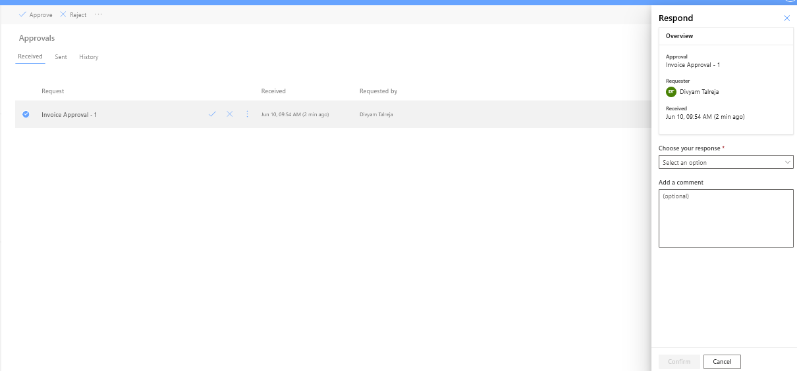
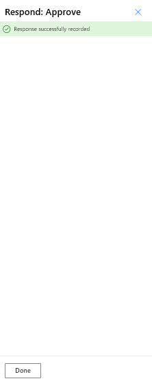
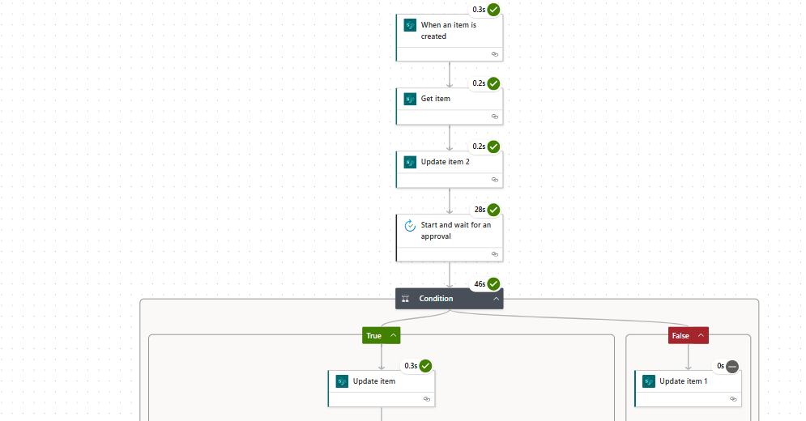
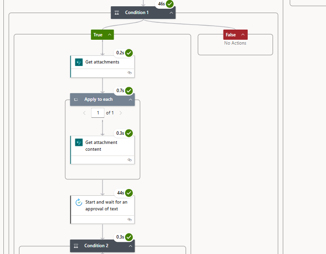
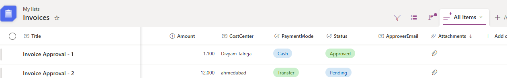
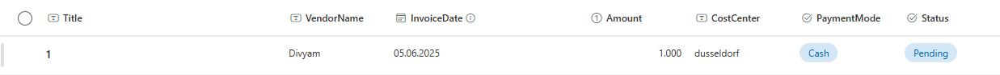
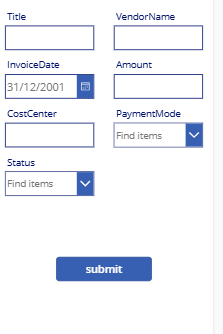

# 🧾 Invoice Approval Automation System

A robust and secure invoice approval automation system built using **Microsoft Power Platform**—**Power Apps**, **Power Automate**, and **SharePoint**. This solution digitizes and streamlines manual invoice processing through an intuitive, role-based approval workflow with email notifications and a centralized tracking dashboard.

---

## 🚀 Features

1. ✅ **Role-Based Access Control**  
   - Separate interfaces and permissions for Requesters, Approvers, and Admins.  
   - Access logic controlled via Power Apps user functions and SharePoint roles.

2. 🔁 **Multi-Level Approval Workflow**  
   - Invoices go through two or more approval stages depending on amount or department.  
   - Approvers can approve or reject with comments.

3. 📧 **Automated Email Notifications**  
   - Emails sent to approvers upon invoice submission.  
   - Notifications for approvals, rejections, and reminders.

4. 📁 **Centralized Document Management**  
   - Invoices are uploaded via Power Apps and stored in a SharePoint Document Library.  
   - Metadata (vendor, amount, date, etc.) tracked in a SharePoint list.

5. 📊 **Real-Time Invoice Dashboard**  
   - Built-in Power Apps view showing invoice status by user, date, or stage.  
   - Users can filter to view their submissions, pending approvals, and history.

6. 🏷️ **Custom Status Management**  
   - Invoice status moves through: Submitted → Pending Approval → Approved/Rejected.  
   - Color-coded statuses for quick visual tracking.

7. 📌 **Integration with Microsoft 365**  
   - Uses organization credentials for secure access.  
   - Seamless experience inside the Microsoft 365 ecosystem.

---

## 🛠️ Technology Stack

- **Power Apps** – User interface for submitting and tracking invoices  
- **Power Automate** – Workflow automation  
- **SharePoint Online** – Data and document storage  
- **Microsoft 365** – Authentication and security

---

## 🏗️ System Workflow

1. User logs in with Microsoft 365 credentials  
2. Invoice is submitted through Power Apps with metadata and attachments  
3. Entry created in SharePoint List; file uploaded to SharePoint Library  
4. Power Automate triggers on submission  
5. Flow checks approval conditions and routes accordingly  
6. Approver receives email with invoice details and action links  
7. Approver approves or rejects; status updates in SharePoint  
8. Dashboard reflects updated status in Power Apps  
9. Reminders are sent if action is delayed

---

## ⚙️ Setup Instructions

### ✅ Prerequisites

- Microsoft 365 account with access to:
  - Power Apps  
  - Power Automate  
  - SharePoint Online

### 🧩 Setup Steps

1. **Clone the Repository**  
   ```bash
   git clone https://github.com/your-username/invoice-approval-automation.git
2. **Import the Solution ZIP File**  
   - Go to [Power Platform Admin Center](https://make.powerapps.com) or [Power Automate](https://flow.microsoft.com)  
   - Navigate to **Solutions > Import**  
   - Upload the `invoicesystem.zip` file  
   - This will import both the Power Apps app and the Power Automate flows included in the solution  

3. **Configure SharePoint List: `Invoices`**

Create a SharePoint list named `Invoices` with the following columns:

| Column Name      | Type                | Description                          |
|------------------|---------------------|--------------------------------------|
| `Title`          | Single line of text | Invoice title or reference           |
| `VendorName`     | Single line of text | Name of the vendor                   |
| `InvoiceDate`    | Date and Time       | Date of the invoice                  |
| `Amount`         | Currency            | Invoice amount                       |
| `CostCenter`     | Single line of text | Cost center identifier               |
| `PaymentMode`    | Choice              | e.g., Bank Transfer, Cheque, UPI     |
| `Status`         | Choice              | Submitted, Pending, Approved, Rejected |
| `ApprovalEmail`  | Single line of text | Email of the approver                |
| `Attachments`    | Attachments Enabled | Upload invoice files here            |

> Make sure attachments are enabled for the list.

4. **Update Connections and Settings**  
   - After import, open the Power Apps app and Power Automate flows inside the solution  
   - Update SharePoint site URL and list names if required  
   - Reconnect data sources to your SharePoint environment  
   - Save and publish the app and flows  

5. **Test the System**  
   - Submit an invoice via the app  
   - Verify email notifications are sent to the approver's email (from `ApprovalEmail` field)  
   - Approve or reject the invoice and check status updates in the app and SharePoint list
  
## 🖼️ Screenshots

### Approval Screen



### Power Automate Flows




### SharePoint Setup



### PowerApps Form



